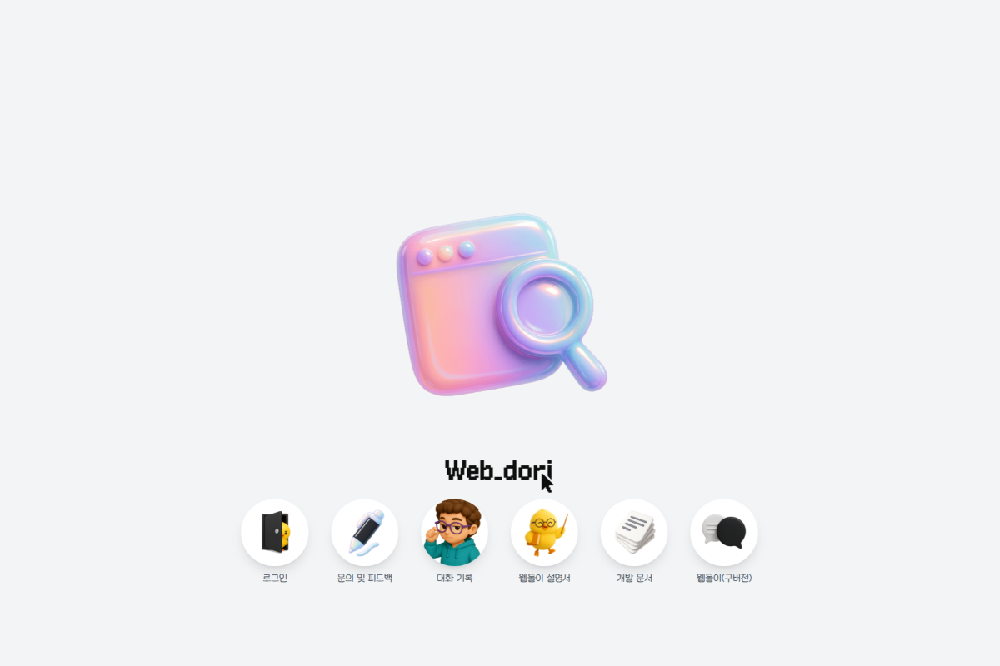
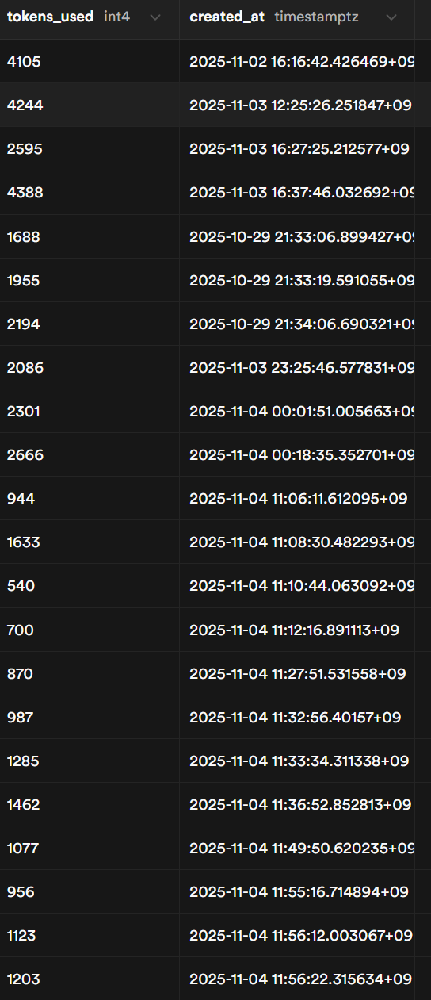
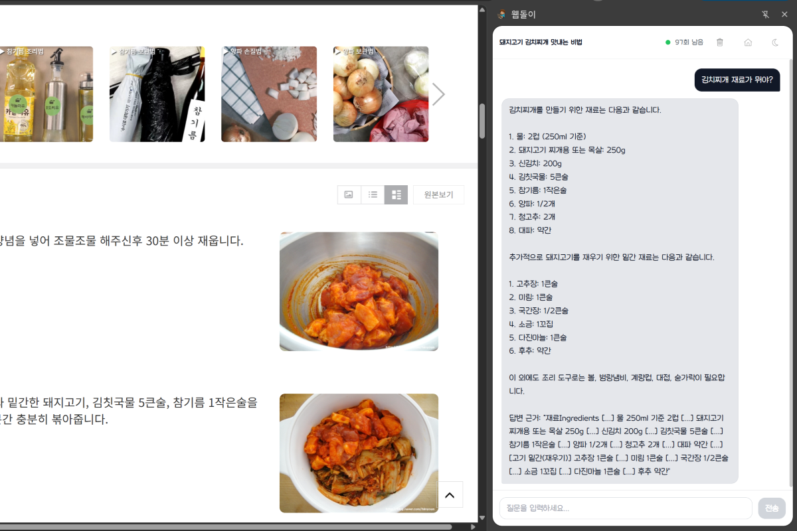
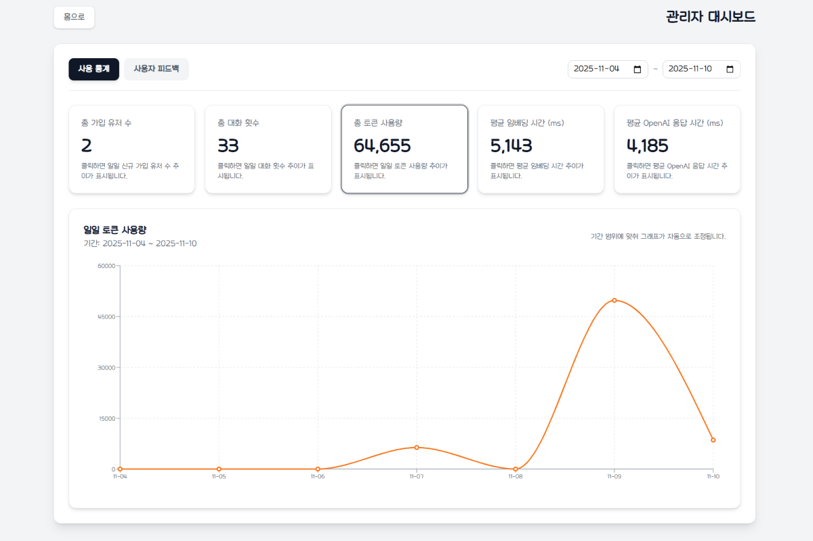
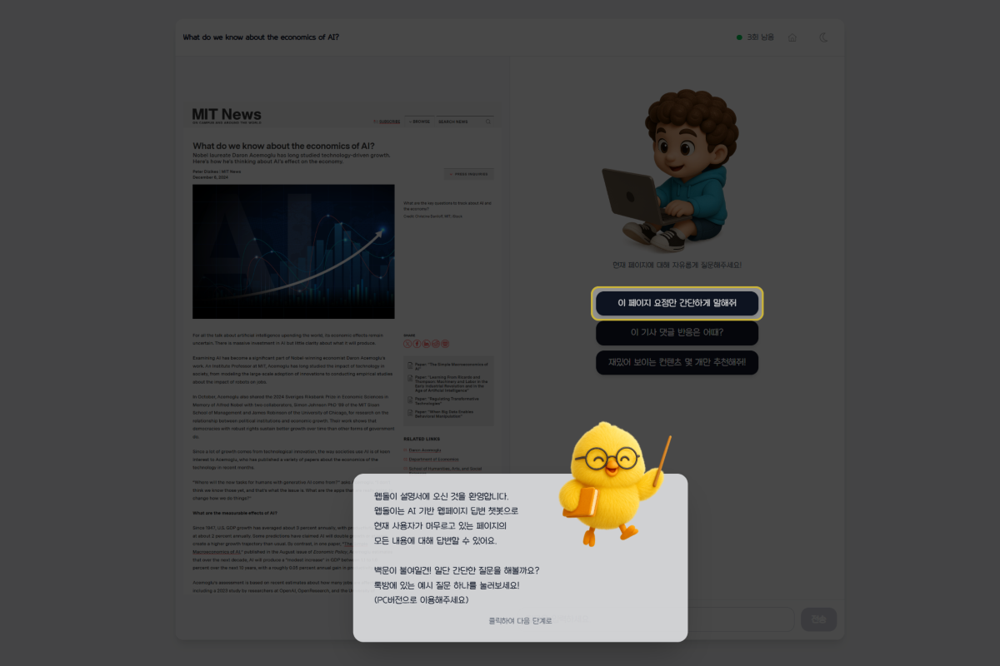

<div style="text-align: left;">
    <h2 style="border-bottom: 1px solid #d8dee4; color: #282d33;"> 🛠️ Tech Stacks </h2> <br> 
    <div  align= "center"> 
      
      
      
      
      <br/>
      
      
      
      
      <br/>
      
    </div>
    <br>
</div>
<div style="text-align: left;">
  <h2 style="border-bottom: 1px solid #d8dee4; color: #282d33;"> 🧑‍💻 Contact me </h2> <br> 
  <div align="center">
    <a href="https://www.notion.so/279cb65d7dc34f7f93ed9c20456e133c" target="_blank">
      
    </a>
    <a href="mailto:kksan12@gmail.com">
      
    </a>
  </div>  
  <br>
</div>

<!--
**sani0928/sani0928** is a ✨ _special_ ✨ repository because its `README.md` (this file) appears on your GitHub profile.

Here are some ideas to get you started:

- 🔭 I’m currently working on ...
- 🌱 I’m currently learning ...
- 👯 I’m looking to collaborate on ...
- 🤔 I’m looking for help with ...
- 💬 Ask me about ...
- 📫 How to reach me: ...
- 😄 Pronouns: ...
- ⚡ Fun fact: ...
-->


# [웹돌이 (Webdori)](https://chromewebstore.google.com/detail/dkkelmoggdihadhbpaalbokbgngkhfkn?utm_source=item-share-cb)
웹페이지 내용을 기반으로 AI가 질문에 답변해주는 스마트 웹 어시스턴트입니다. Chrome 확장 프로그램과 웹 애플리케이션 두 가지 형태로 제공됩니다.

## 개요

웹돌이는 사용자가 방문한 웹페이지의 내용을 실시간으로 분석하여 AI에게 질문할 수 있도록 돕는 서비스입니다. 복잡한 웹페이지의 핵심 정보를 빠르게 파악하거나, 페이지 내용에 대한 질문에 즉각적인 답변을 받을 수 있습니다.



## 주요 기능

### 웹 분석
- 현재 방문한 웹페이지의 내용을 자동으로 추출 및 분석
- 복잡한 페이지 구조를 이해하고 핵심 정보 파악
- HTML 구조 보존 (테이블, 리스트, 제목 등)으로 정확도 향상

### AI 기반 질문 답변
- OpenAI GPT 모델을 활용한 자연어 대화
- 실시간 스트리밍 답변으로 즉각적인 피드백 제공
- 대화 기록 저장으로 이전 문맥 유지

### RAG (Retrieval-Augmented Generation)
- PostgreSQL + pgvector 기반 벡터 데이터베이스
- 웹페이지 내용을 청크 단위로 임베딩하여 저장
- 질문과 관련된 내용만 검색하여 정확한 답변 제공
- 본문 중심 청크 추출과 근거 문장 표시로 사이드 배너·추천 영역 등 노이즈를 최소화
- 스마트 캐싱으로 응답 속도 개선 및 비용 절감



**Chrome 확장 프로그램 - 팝업**


**Chrome 확장 프로그램 - 사이드패널**


### 멀티 플랫폼 지원
- Chrome 확장 프로그램: 어떤 웹페이지에서든 바로 사용 가능
- 웹 애플리케이션: 독립적인 채팅 인터페이스 제공

### 사용자 인증 시스템
- 이메일/비밀번호 기반 회원가입 및 로그인
- 구글 소셜 로그인 지원
- 카카오 소셜 로그인 지원
- 역할 기반 접근 제어 (일반 회원/관리자)
- JWT 토큰 기반 무상태(Stateless) 인증
- Chrome 확장 프로그램과 웹 앱 간 실시간 로그인 동기화
- 사용자 친화적 회원가입 UI (이메일 드롭다운, 비밀번호 규칙 검증)


### 사용량 관리
- 서비스 유지를 위한 일반 회원 일일 사용 제한 (100회)
- 실시간 사용량 추적 및 표시
- 일간/주간/월간 통계 조회 및 대화 기록 관리
- 임베딩/LLM 응답 시간을 기록하여 성능 추이를 분석



### 성능 모니터링 & 관리자 대시보드
- `ConversationPerformance` 로그를 기반으로 임베딩/LLM/전체 응답 시간을 집계
- 관리자 전용 `/admin` 페이지에서 통계 카드와 선 그래프로 성능 지표 시각화
- `/api/admin/stats`, `/api/admin/feedback` 등 관리자 전용 API 제공
- 날짜 범위를 조절해 기간별 평균과 추세를 비교 분석
- 관리자 계정 전용 접근 제어

### SEO 최적화
- 동적 sitemap.xml 및 robots.txt 생성
- Open Graph 메타 태그 적용
- 검색 엔진 최적화로 서비스 접근성 향상



### 체험형 가이드
- 인터랙티브 튜토리얼 페이지 (`/manual`)
- 시나리오 기반 단계별 안내
- 실제 AI 응답을 통한 체험 제공
- 포커싱 및 하이라이트 효과로 사용자 가이드

### 반응형 디자인
- 모바일, 태블릿, 데스크톱 전 기기 대응
- Tailwind CSS 기반 반응형 레이아웃
- 전역 페이지 전환 애니메이션
- 부드러운 인터랙션 및 애니메이션 효과
- 일관된 사용자 경험 제공

## 기술 스택

### Backend
- **FastAPI**: Python 웹 프레임워크
- **PostgreSQL**: 관계형 데이터베이스 (Supabase)
- **pgvector**: 벡터 유사도 검색 확장
- **SQLAlchemy**: ORM 프레임워크
- **OpenAI API**: GPT 모델 및 임베딩 생성
- **JWT**: 토큰 기반 인증
- **BeautifulSoup4**: HTML 파싱 및 구조 보존

### Frontend
- **Next.js**: React 기반 풀스택 프레임워크
- **TypeScript**: 타입 안정성 제공
- **Tailwind CSS**: 유틸리티 기반 스타일링
- **Framer Motion**: 부드러운 애니메이션
- **recharts**: 차트 그래프

### Chrome Extension
- **Manifest V3**: Chrome 확장 프로그램 표준
- **Content Scripts**: 웹페이지 콘텐츠 접근 및 localStorage 동기화
- **Service Worker**: 백그라운드 작업 처리 및 상태 관리
- **chrome.storage.local**: 확장 프로그램 데이터 저장소

### 인프라
- **Railway**: 백엔드 호스팅
- **Vercel**: 프론트엔드 호스팅
- **Supabase**: PostgreSQL 데이터베이스 호스팅

## 프로젝트 구조

```
webdori/
├── backend/                      # FastAPI 백엔드 서버
│   ├── app/
│   │   ├── api/v1/              # API 라우터 (v1)
│   │   │   ├── auth.py          # 인증 엔드포인트
│   │   │   ├── chat.py          # 채팅 및 RAG 엔드포인트
│   │   │   ├── stats.py         # 통계 엔드포인트
│   │   │   └── admin.py         # 관리자 통계·피드백·성능 API
│   │   ├── core/                # 핵심 설정
│   │   │   ├── config.py        # 환경 변수 관리
│   │   │   └── database.py      # DB 연결 및 초기화
│   │   ├── models/              # SQLAlchemy 모델
│   │   │   ├── user.py          # 사용자 모델
│   │   │   ├── conversation.py  # 대화 기록 모델
│   │   │   ├── page_chunk.py    # RAG 청크 모델
│   │   │   ├── daily_usage.py   # 일일 사용량 모델
│   │   │   └── conversation_performance.py # 응답 시간 로그 모델
│   │   ├── services/            # 비즈니스 로직
│   │   │   ├── auth_service.py  # 인증 서비스
│   │   │   ├── embedding_service.py # RAG 임베딩
│   │   │   └── cache_cleanup.py # 캐시 정리
│   │   └── dependencies.py      # FastAPI 의존성
│   ├── requirements.txt         # Python 의존성
│   ├── init_db.py              # DB 초기화 스크립트
│   └── run_cleanup.py          # 캐시 정리 스크립트
├── frontend/                    # Next.js 웹 애플리케이션
│   ├── app/                    # App Router 페이지
│   │   ├── page.tsx            # 홈 페이지
│   │   ├── chat/page.tsx       # 채팅 페이지
│   │   ├── stats/page.tsx      # 통계 페이지
│   │   ├── manual/page.tsx     # 체험형 가이드 페이지
│   │   ├── admin/page.tsx      # 관리자 대시보드
│   │   ├── layout.tsx          # 루트 레이아웃
│   │   ├── sitemap.ts          # 동적 사이트맵
│   │   └── robots.ts           # 동적 robots.txt
│   ├── components/             # 재사용 컴포넌트
│   │   ├── LoginModal.tsx      # 로그인 모달
│   │   ├── SignupModal.tsx     # 회원가입 모달
│   │   ├── FirstInfoModal.tsx  # 첫 방문 안내 모달
│   │   ├── CheckLogoutModal.tsx # 로그아웃 확인 모달
│   │   ├── LegacyWebdoriButton.tsx # 레거시 버튼 애니메이션
│   │   └── PageTransition.tsx  # 페이지 전환 애니메이션
│   └── package.json            # Node.js 의존성
├── chrome_extension/           # Chrome 확장 프로그램
│   ├── popup.js               # 팝업 UI 로직
│   ├── background.js          # Service Worker
│   ├── content.js             # Content Script (동기화)
│   ├── manifest.json          # 확장 프로그램 설정
│   └── icons/                 # 확장 프로그램 아이콘
└── README.md                  # 프로젝트 문서
```

## 시작하기

### 사전 요구사항
- Python 3.12 이상
- Node.js 18 이상
- PostgreSQL 데이터베이스 + pgvector (Vector DB)
- OpenAI API 키
- Google OAuth 클라이언트 ID
- Kakao OAuth JS KEY

### 백엔드 설정

```bash
cd backend

# 가상환경 생성 및 활성화
python -m venv venv
.\venv\Scripts\activate  # Windows
# source venv/bin/activate  # Linux/Mac

# 의존성 설치
pip install -r requirements.txt

# 환경 변수 설정 (.env 파일 생성)
cp .env.example .env
# .env 파일을 편집하여 API 키 및 데이터베이스 정보 입력

# 데이터베이스 초기화
python init_db.py

# (선택) RAG 캐시 정리 (3일 이상 오래된 데이터)
python run_cleanup.py

# 서버 실행
uvicorn app.main:app --host 0.0.0.0 --port 8000 --reload
```

### 프론트엔드 설정

```bash
cd frontend

# 의존성 설치
npm install

# 환경 변수 설정 (.env.local 파일 생성)
# NEXT_PUBLIC_API_URL=http://localhost:8000

# 개발 서버 실행
npm run dev
```
### Chrome 확장 프로그램 설정

```bash
cd chrome_extension

# config.js 설정
# API_URL을 배포된 백엔드 주소 또는 로컬 주소로 변경

# 확장 프로그램 로드
# 1. Chrome 브라우저에서 chrome://extensions/ 접속
# 2. 우측 상단 "개발자 모드" 활성화
# 3. "압축해제된 확장 프로그램을 로드합니다" 클릭
# 4. chrome_extension 폴더 선택
```

## API 엔드포인트

### 인증 (`/api/auth`)
- `POST /api/auth/register` - 사용자 회원가입
- `POST /api/auth/login` - 이메일 로그인
- `POST /api/auth/google-login` - Google 로그인
- `GET /api/auth/kakao/callback` - Kakao 로그인 콜백
- `GET /api/auth/me` - 현재 사용자 정보 조회
- `PUT /api/auth/check-first-info` - 첫 방문 안내 모달 표시 여부 업데이트
- `POST /api/auth/feedback` - 피드백 제출 (로그인 선택)

### 채팅 (`/api`)
- `POST /api/chat-stream` - 스트리밍 채팅 (회원 전용, Rate Limit: 100/일)
- `POST /api/chat` - 일반 채팅 (레거시, 회원 전용, Rate Limit: 100/일)
- `POST /api/fetch-page` - 웹페이지 내용 가져오기

### 통계 (`/api/stats`)
- `GET /api/stats/daily` - 일일 사용량 조회 (회원 전용)
- `GET /api/stats/weekly` - 주간 사용량 조회 (회원 전용)
- `GET /api/stats/monthly` - 월간 사용량 조회 (회원 전용)

### 관리자 (`/api/admin`)
- `GET /api/admin/stats` - 관리자용 사용 통계 및 성능 지표 조회
- `GET /api/admin/feedback` - 사용자 피드백 목록 조회

자세한 API 명세는 `backend/API_SPEC.md` 파일을 참고하세요.

## 배포

### 백엔드 배포 (Railway)
1. Railway CLI 설치 및 로그인
2. 프로젝트 초기화
3. 환경 변수 설정
4. Git push를 통한 자동 배포

### 프론트엔드 배포 (Vercel)
1. Vercel CLI 설치 및 로그인
2. 프로젝트 임포트
3. 환경 변수 설정 (`NEXT_PUBLIC_API_URL`, `NEXT_PUBLIC_GOOGLE_CLIENT_ID`)
4. Git push를 통한 자동 배포

### Chrome 확장 프로그램 배포
1. `manifest.json`에서 버전 업데이트
2. `config.js`에서 프로덕션 API URL 설정
3. chrome_extension 폴더를 .zip 파일로 압축
4. Chrome Web Store Developer Dashboard에서 업로드

## 주요 기능 상세

### RAG (Retrieval-Augmented Generation) 시스템
- **벡터 임베딩**: OpenAI text-embedding-3-small 모델 사용
- **청크 단위 저장**: 페이지를 500자 단위로 분할하여 저장
- **유사도 검색**: pgvector의 코사인 유사도 기반 검색
- **HNSW 인덱스**: 빠른 벡터 검색을 위한 인덱스 최적화
- **TTL 캐싱**: 24시간 캐시로 API 비용 99% 절감

### HTML 구조 보존
- **테이블 변환**: HTML 테이블 → 마크다운 표 형식
- **리스트 변환**: ul/ol → 불릿/번호 리스트
- **제목 보존**: h1-h6 → 마크다운 헤더
- **정확도 향상**: 구조 정보 유지로 답변 정확도 대폭 개선

### 로그인 동기화 시스템
- **Content Script**: 웹사이트의 localStorage 변경 감지
- **실시간 동기화**: 로그인/로그아웃 즉시 확장 프로그램에 반영
- **다중 트리거**: storage 이벤트, load 이벤트, DOMContentLoaded 이벤트
- **Debounce**: 중복 요청 방지로 성능 최적화

### 캐시 관리
- **자동 갱신**: 검색 시마다 `last_accessed_at` 업데이트
- **TTL 기반**: 24시간 후 자동 만료 및 재생성
- **수동 정리**: `run_cleanup.py`로 오래된 캐시 삭제
- **비용 절감**: 캐시 관리 이전 대비 월 $4.2 절감 효과 (사용량에 따라 변동)

## 개발 가이드

### 백엔드 가이드
- `backend/ARCHITECTURE_COMPLETE.md` - 전체 아키텍처 설명
- `backend/API_SPEC.md` - API 명세서
- `backend/CACHING_GUIDE.md` - RAG 캐싱 가이드
- `backend/HTML_STRUCTURE_GUIDE.md` - HTML 구조 보존 가이드

### 확장 프로그램 가이드
- `chrome_extension/LOGIN_SYNC_FIX.md` - 로그인 동기화 해결 방법
- `chrome_extension/JWT_DECODE_SOLUTION.md` - JWT 디코딩 솔루션
- `chrome_extension/AUTH_FLOW_EXPLAINED.md` - 인증 플로우 설명

## 라이선스

이 프로젝트는 개인 프로젝트로, 상업적 사용 시 개발자에게 문의 부탁드립니다.

## 버전 히스토리

### v0.5.0 (2025-11.01)
- 초기 배포
- 기본 채팅 기능 및 사용자 인증
- Chrome 확장 프로그램 및 웹 앱 지원

### v0.6.0 (2025-11.04)
- RAG (Retrieval-Augmented Generation) 시스템 추가
- HTML 구조 보존으로 답변 정확도 향상
- 스마트 캐싱 시스템
- 로그인 동기화 버그 수정
- SEO 최적화 (sitemap.xml, robots.txt)
- 모바일 친화적 반응형 디자인 개선
- 로그아웃 확인 모달 추가

### v0.7.0 (2025-11-06)
- Kakao 소셜 로그인 지원 추가
- 인터랙티브 체험형 가이드 페이지 (`/manual`) 추가
- 첫 방문 사용자 안내 모달 (FirstInfoModal) 추가
- 회원가입 UI 개선 (이메일 드롭다운, 비밀번호 규칙 실시간 검증)
- 전역 페이지 전환 애니메이션 추가
- 홈 화면 랜덤 아이콘 표시 기능
- "웹돌이(구버전)" 버튼 인터랙티브 애니메이션 추가

### v0.8.0 (2025-11-09)
- ConversationPerformance 테이블 도입으로 임베딩/LLM/전체 응답 시간 기록
- `/api/admin/stats` 확장 및 `/api/admin/feedback` 개선
- 관리자 대시보드에 성능 지표 카드 및 선 그래프 추가
- 날짜 범위 필터와 탭 구조 리팩터링으로 분석 편의성 향상
- Chrome 확장 프로그램 다크모드 추가
- 본문 추출 및 프롬프트 개선으로 RAG 노이즈 감소

### v1.0.0 (2025-11-10)
- 웹페이지 이미지 용량 최적화
- 사용자 하루 사용량 수정
- 안정적인 배포를 위한 코드 리팩토링 및 DB 정리

## 개인정보처리방침

웹돌이 서비스(Chrome 확장 프로그램 및 웹 애플리케이션 포함)는 다음과 같은 개인정보 처리 방침을 따릅니다.

- **수집 항목**: 회원가입 시 이메일 등 계정 정보, 서비스 이용 중 질문·답변 기록, 페이지 URL 및 제목, 사용량/성능 데이터(임베딩·LLM 처리 시간), 문의·피드백 내용. 민감정보(결제 정보, 브라우저 히스토리 등)는 수집하지 않습니다.
- **이용 목적**: AI 답변 제공 및 품질 향상(RAG), 사용량 제한 관리, 성능 모니터링, 고객 지원/피드백 대응.
- **보관 및 파기**: 계정 삭제 요청 시 관련 데이터를 삭제하며, 목적 달성 후에는 익명화 또는 파기합니다.
- **제3자 제공 및 위탁**: 기본적으로 내부에서만 활용하며, OpenAI API 호출 시 질문/맥락 텍스트가 모델에게 전달될 수 있습니다. 기타 제3자 제공은 이용자 동의 또는 법령 근거가 있는 경우에 한합니다.
- **보안 조치**: HTTPS 전송, 접근 통제, 최소 권한 원칙 등으로 데이터를 보호합니다.
- **사용자 권리**: 데이터 열람·정정·삭제·동의 철회는 kksan12@gmail.com 등 연락처로 요청하실 수 있습니다.
- **정책 변경**: 변경 사항은 서비스 내 공지 또는 이메일로 안내하며, 본 README 및 공식 문서를 업데이트합니다.

본 방침은 2025년 11월 10일부터 시행됩니다.